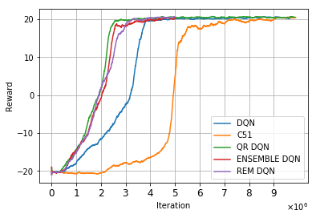
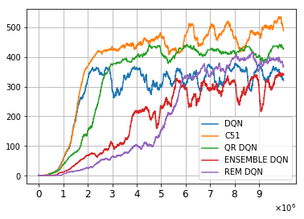

# Batch_RL

Tensorflow implementation for replicating the experiments described in ["Striving for Simplicity in Off-policy Deep Reinforcement Learning"]( https://arxiv.org/abs/1907.04543). This repository aims to implement all variants of DQN used in the paper from scratch in pure tensorflow, whereas code provided by author used dopamine framework. The implementation contains:

[1] Classic DQN: [Human-level control through deep reinforcement learning](https://www.nature.com/articles/nature14236)  
[2] C51: [A Distributional Perspective on Reinforcement Learning](https://arxiv.org/abs/1707.06887)  
[3] QR DQN: [Distributional Reinforcement Learning with Quantile Regression](https://arxiv.org/abs/1710.10044)  
[4] Ensemble DQN: [Striving for Simplicity in Off-policy Deep Reinforcement Learning](https://arxiv.org/abs/1907.04543)  
[5] Random Ensemble Mixture(REM) DQN: [Striving for Simplicity in Off-policy Deep Reinforcement Learning](https://arxiv.org/abs/1907.04543)  

## Paper Review
- [Blog](https://medium.com/@seungwonkim_57156/deep-learning-papers-review-striving-for-simplicity-in-off-policy-deep-reinforcement-learning-ac49c4aa26e2), [Pdf](https://github.com/seungwon1/batch_rl/blob/master/docs/paper_review.pdf)

## Dependencies
- Python 3.6 or greater
- Tensorflow 1.14.0
- Numpy 1.17.3
- OpenAI Gym version 0.10.5
- Matplotlib
- OpenCV
- Box2D 2.3.3
- ffmpeg

## Train DQN

Execute command like below
```
python main.py --arch=DQN --eps=1.0 --final_eps=0.01 --max_frames=10000000 --opt=adam --lr=0.00025 --game=PongNoFrameskip-v4 --train_start=50000 --target_reset=10000
```
Args
```
-arch : Model architecture
-eps : Starting value of epsilon
-final_eps : final value of epsilon
-max_frames : Number of iterations (step count)
-opt : optimizer
-lr : learning rate of optimizer
-num_heads : number of heads for C51, QR-DQN, Ensemble DQN and REM
-game : Atari game env
-train_start : warm-up period before training
-target_reset : reset interval
-online : perform online DQN if true, perform offline DQN which requires static dataset otherwise.
```
For other hyper-parameters, see [here](https://github.com/seungwon1/batch_rl/blob/master/main.py).

Metrics such as loss or evaluation reward can be easily visualized using tensorboard.
```
tensorboard --logdir=results/directory_name
```

## Results
Below figures show online training curves of each DQN in PongNoFrameskip-v4 and BreakoutNoFrameskip-v4. Rewards are averaged over 100 previous episodes.




Hyper-parameters used for each algorithm are [here](https://github.com/seungwon1/batch_rl/blob/master/default_hp).

## Hardware

Each algorithm is trained on a single RTX 2080 ti.

## Reference
- [Deepmind's code](https://sites.google.com/a/deepmind.com/dqn/)  
- [CS294 HW3](https://github.com/berkeleydeeprlcourse/homework/tree/master/hw3)
